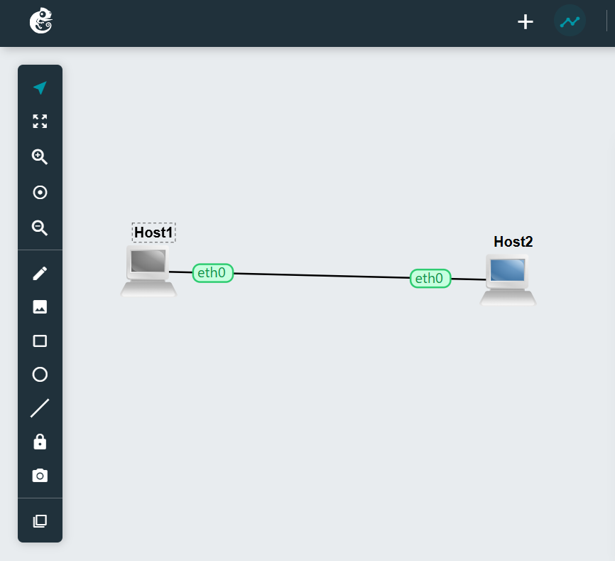
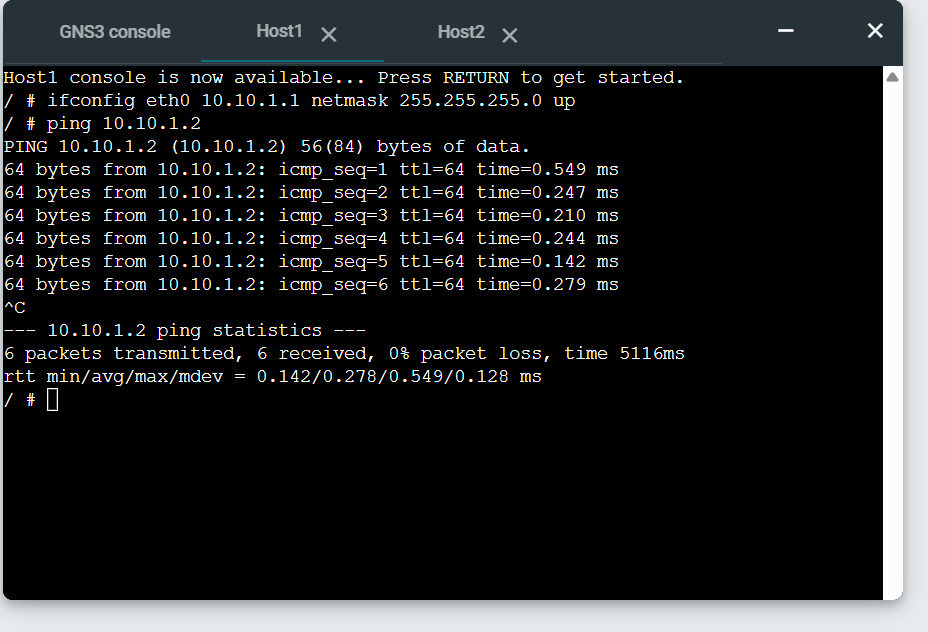

# Week 02 Portfolio – IP Configuration and Ping Test

**Name:** Prasuna Shrestha  
**Student ID:** 12267528
**Unit:** COIT12206 TCP/IP Protocols  
**Week:** 02  
**Date:** 23/03/2026

---

## Objective
The objective of this task was to configure IP addresses on two hosts and test network connectivity using the ping command.

---

## Tasks Completed
I created a GNS3 project and added two Linux Host devices. I connected both hosts using an Ethernet link.

I configured static IP addresses using the command line. Host1 was assigned the IP address 10.10.1.1 and Host2 was assigned 10.10.1.2.

After configuring the IP addresses, I tested connectivity between the two hosts using the ping command.

---

## Network Configuration

- Host1 IP Address: 10.10.1.1  
- Host2 IP Address: 10.10.1.2  
- Subnet Mask: 255.255.255.0  

---

## Commands Used
```bash
ifconfig eth0 10.10.1.1 netmask 255.255.255.0 up
ifconfig eth0 10.10.1.2 netmask 255.255.255.0 up
ping 10.10.1.2
``` 
## Screenshots / Evidence

 

## Testing Results

The ping test was successful. Host1 was able to send packets to Host2 and receive replies. This confirms that both hosts were correctly configured and connected within the same network.

## Key Concepts Learned

This task helped me understand how IP addressing works in a network. I learned that devices in the same subnet can communicate directly without a router. I also learned how the ping command is used to test connectivity between devices.

## Reflection

This task improved my understanding of how two devices communicate over a network. I learned how to configure IP addresses using the command line and verify connectivity. It also helped me understand basic troubleshooting when devices cannot communicate.

## Files Produced
GNS3 Project: Week02-IP-Ping-<12267528>.gns3project
Network Screenshot
Ping Test Screenshot
