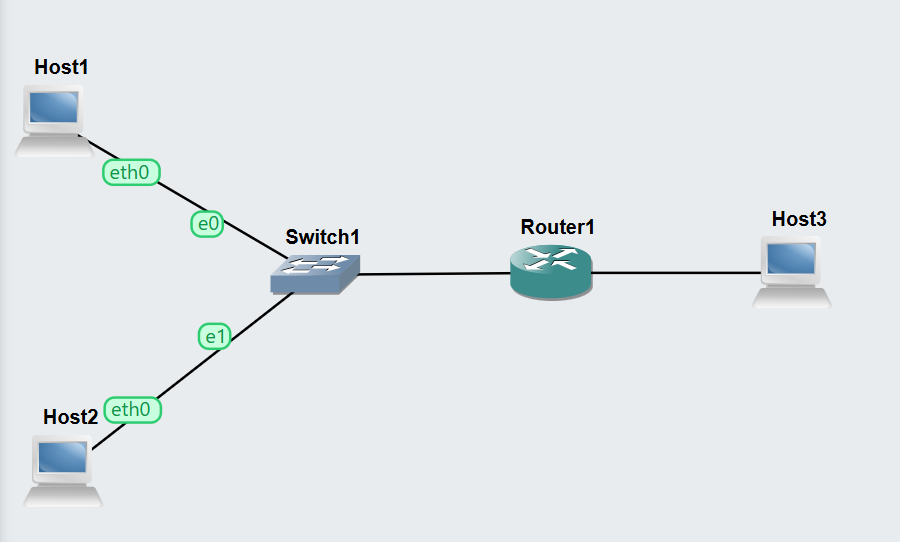
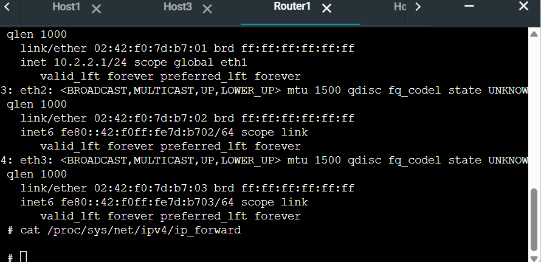
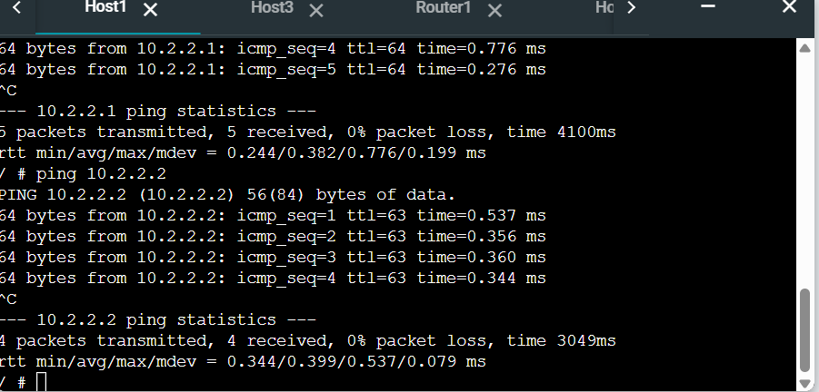

# Week 04 Portfolio – Routing and Forwarding

**Name:** Prasuna Shrestha  
**Student ID:** 12267528  
**Unit:** COIT12206 TCP/IP Protocols  
**Week:** 04  
**Date:** 30/03/2026

---

## Objective
The objective of this task was to understand routing between different subnets, configure a router, and enable communication between hosts on separate networks.

---

## Tasks Completed
I created a GNS3 project and added three Linux Hosts, one Linux Router, and one Ethernet switch. Two hosts were connected to the switch, forming one subnet, while the third host was connected directly to the router, forming a second subnet.

I configured IP addresses for all hosts and router interfaces. I then enabled IP forwarding on the router to allow packet routing between the two networks.

---

## Network Configuration

Subnet 1:
- Host1: 10.1.1.2
- Host2: 10.1.1.3
- Router (eth0): 10.1.1.1

Subnet 2:
- Host3: 10.2.2.2
- Router (eth1): 10.2.2.1

---

## Commands Used
```bash
ip addr add 10.1.1.2/24 dev eth0
ip addr add 10.1.1.3/24 dev eth0
ip addr add 10.2.2.2/24 dev eth0

ip route add default via 10.1.1.1
ip route add default via 10.2.2.1

ip addr add 10.1.1.1/24 dev eth0
ip addr add 10.2.2.1/24 dev eth1
ip link set eth0 up
ip link set eth1 up
echo 1 > /proc/sys/net/ipv4/ip_forward

ping 10.2.2.2
```

### Screenshots / Evidence






### Testing Results

The ping test from Host1 to Host3 was successful. This confirmed that the router was correctly forwarding packets between the two subnets. Without enabling IP forwarding, communication between different networks would not be possible.

### Key Concepts Learned

This task helped me understand how routing works between different networks. A router is required to forward packets between subnets. I also learned that enabling IP forwarding is necessary for a device to act as a router.

### Reflection

This task improved my understanding of how networks communicate beyond a single subnet. I learned how routers connect different networks and how IP forwarding enables packet movement. This task also helped me understand troubleshooting when connectivity fails.

### Files Produced
GNS3 Project: Week04-Routing-12267528
Network Screenshot
Router Configuration Screenshot
Ping Result Screenshot
