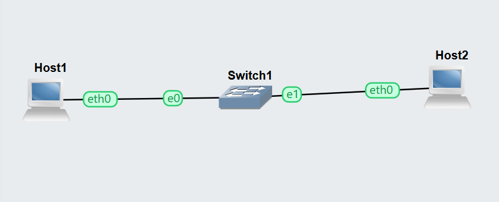
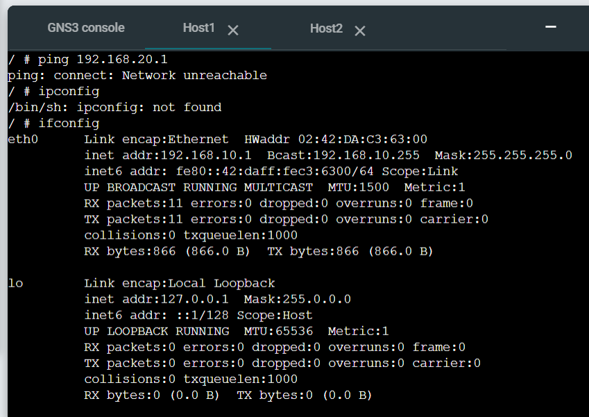
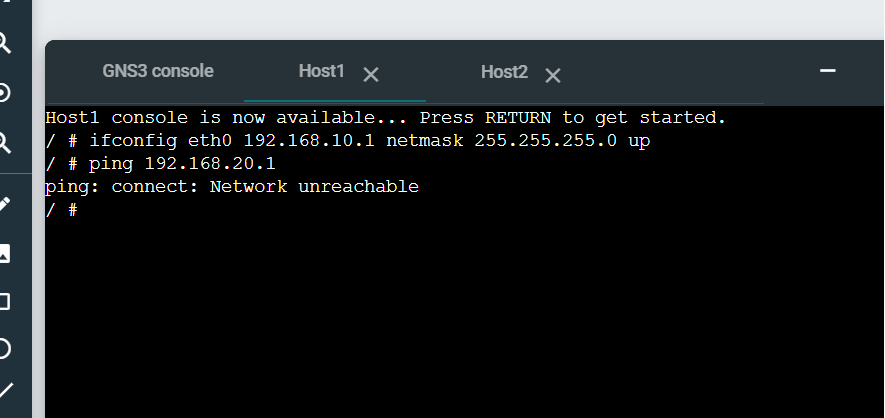

# Week 05 Portfolio – VLAN Configuration

**Name:** Prasuna Shrestha  
**Student ID:** 12267528  
**Unit:** COIT12206 TCP/IP Protocols  
**Week:** 05  
**Date:** 06/04/2026

---

## Objective
The objective of this task was to understand VLANs and how they separate network traffic between devices.

---

## Tasks Completed
I created a GNS3 project and added two Linux Hosts connected through a switch. I configured different IP addresses for each host, placing them in different subnets.

I tested communication between the hosts using the ping command.

---

## Network Configuration

- Host1: 192.168.10.1  
- Host2: 192.168.20.1  
- Subnet Mask: 255.255.255.0  

---

## Commands Used
```bash
ifconfig eth0 192.168.10.1 netmask 255.255.255.0 up
ifconfig eth0 192.168.20.1 netmask 255.255.255.0 up
ping 192.168.20.1
```

### Screenshots / Evidence






### Testing Results

The ping test was unsuccessful. Host1 was unable to communicate with Host2, confirming that devices in different VLANs or subnets cannot communicate without routing.

### Key Concepts Learned

This task helped me understand VLAN segmentation and how networks can be logically separated. Devices in different VLANs require a router to communicate.

### Reflection

This task helped me understand how network segmentation improves security and performance. I learned how VLANs isolate traffic and prevent direct communication between different networks.

### Files Produced
GNS3 Project: Week05-VLAN-12267528
Network Screenshot
Host Configuration Screenshot
Ping Result Screenshot
