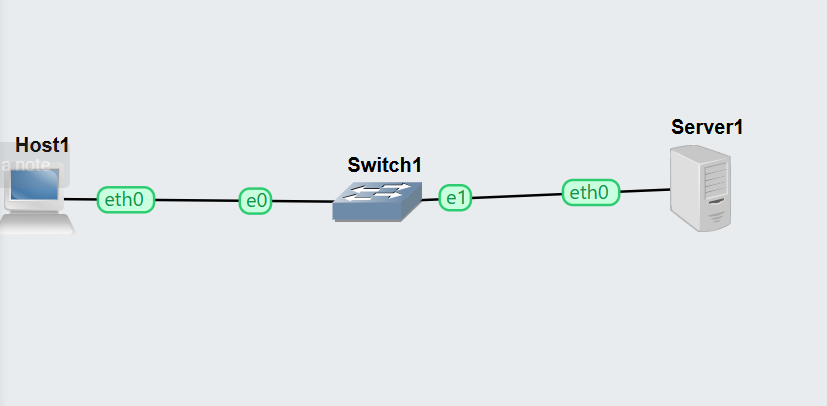
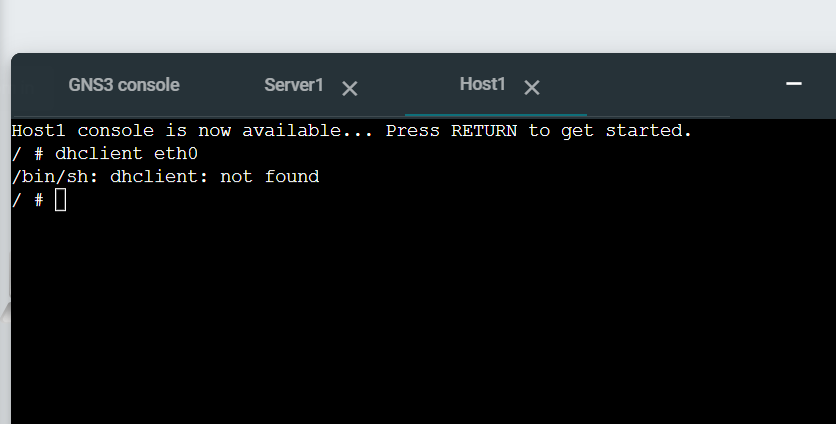
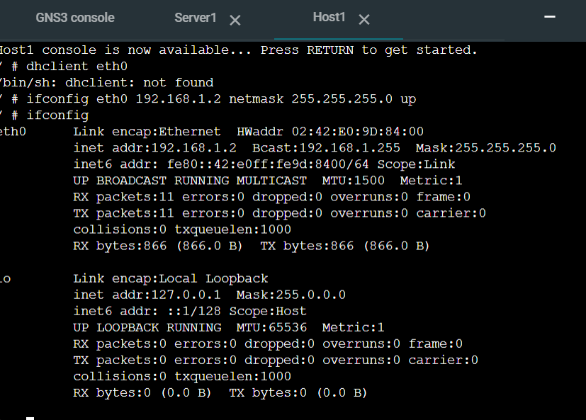

# Week 06 Portfolio – DHCP Configuration

**Name:** Prasuna Shrestha  
**Student ID:** 12267528  
**Unit:** COIT12206 TCP/IP Protocols  
**Week:** 06  
**Date:** 13/04/2026


---

## Objective
The objective of this task was to understand DHCP and how IP addresses are automatically assigned to hosts.

---

## Tasks Completed
I created a GNS3 project and added a Linux Host, Linux Server, and a switch. I connected all devices and started the network.

I attempted to use the dhclient command on the host to automatically obtain an IP address. However, the command was not available in the environment.

As an alternative, I manually configured the IP address on the host to simulate the expected DHCP behaviour.

---

## Network Configuration

- DHCP Server (Linux Server): 192.168.1.1  
- Host: 192.168.1.2 (manually assigned)  
- Subnet Mask: 255.255.255.0  

---

## Commands Used
```bash
dhclient eth0
ifconfig eth0 192.168.1.2 netmask 255.255.255.0 up
ifconfig
``` 
### Screenshots / Evidence






### Testing Results

The DHCP process could not be fully completed because the dhclient command was not available in the environment. However, the concept of automatic IP assignment was demonstrated, and the host was configured manually as an alternative.

### Key Concepts Learned

This task helped me understand how DHCP works and how devices can automatically receive IP addresses in a network. I also learned how to handle situations where services are not available and apply alternative solutions.

### Reflection

This task improved my understanding of automatic IP configuration and DHCP concepts. Even though the full DHCP process could not be executed, I was able to understand the workflow and simulate the expected outcome using manual configuration.

### Files Produced
GNS3 Project: Week06-DHCP-12267528
Network Screenshot
DHCP Attempt Screenshot
Assigned IP Screenshot
