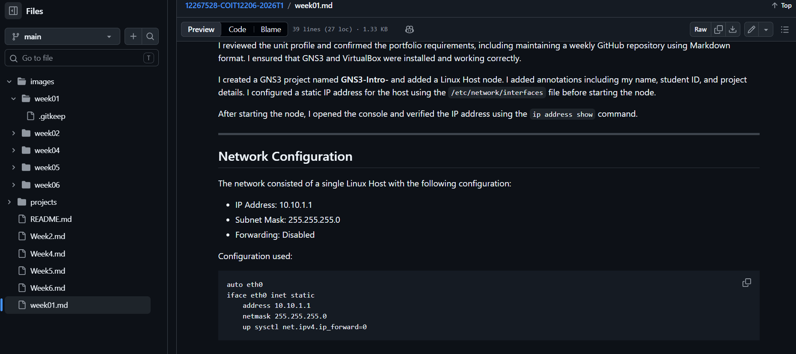
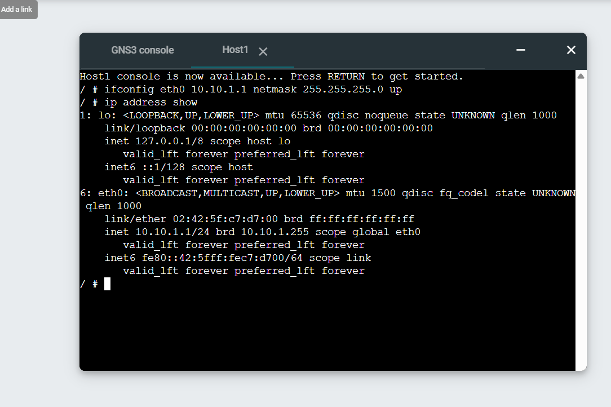

# Week 01 Portfolio – GNS3 Introduction and Static IP Setup

**Name:** Prasuna Shrestha
**Student ID:** 12267528
**Unit:** COIT12206 TCP/IP Protocols  
**Week:** 01  
**Date:** 9/03/2026

---

## Objective
The objective of this task was to understand the unit requirements, set up the required tools, and practice basic GNS3 usage including configuring a Linux host with a static IP address.

---

## Tasks Completed
I reviewed the unit profile and confirmed the portfolio requirements, including maintaining a weekly GitHub repository using Markdown format. I ensured that GNS3 and VirtualBox were installed and working correctly.

I created a GNS3 project named GNS3-Intro-<studentid> and added a Linux Host node. I added annotations including my name, student ID, and project details.

I configured a static IP address for the host using the `/etc/network/interfaces` file before starting the node. After starting the node, I opened the console and verified the IP address using the `ip address show` command.

---

## Network Configuration
The network consisted of a single Linux Host with the following configuration:

- IP Address: 10.10.1.1  
- Subnet Mask: 255.255.255.0  
- Forwarding: Disabled  

Configuration used:

```bash
auto eth0
iface eth0 inet static
    address 10.10.1.1
    netmask 255.255.255.0
    up sysctl net.ipv4.ip_forward=0
```


## Screenshots / Evidence




## Testing Results

The ip address show command confirmed that the IP address was successfully assigned to the Linux host. The configuration was correctly applied and visible in the interface details.

## Key Concepts Learned

This task helped me understand how static IP addressing works in a Linux environment. Configuring the /etc/network/interfaces file ensures that the IP settings remain after reboot. I also learned that hosts should not forward packets, so IP forwarding should be disabled.

## Reflection

This task helped me become familiar with GNS3 and basic Linux networking. I learned how to configure a static IP address and verify it using command line tools. Initially, I needed to understand where to configure the settings and how to apply them correctly. This task built a strong foundation for more advanced networking concepts in later weeks.

## Files Produced
GNS3 Project: GNS3-Intro-12267528.gns3project
Network Screenshot
Console Screenshot showing IP address
